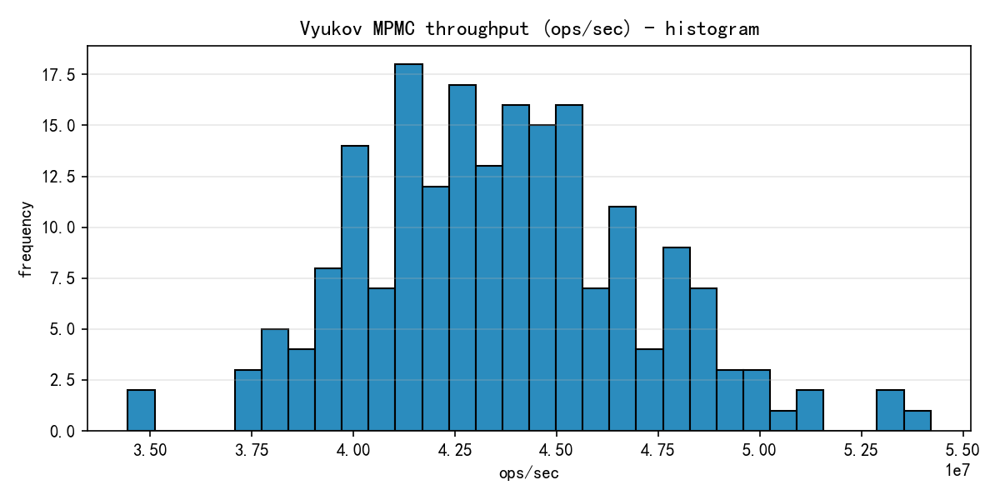
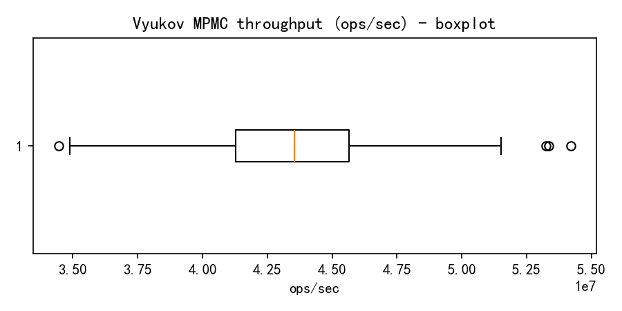

# Vyukov MPMC throughput report

数据文件: `perf_samples_200.csv`

## 统计摘要

- 样本数: 200
- 平均 (mean): 43631329.56 ops/sec
- 中位数 (median): 43546578.56 ops/sec
- 标准差 (stddev): 3429885.57 ops/sec
- 最小值: 34444256.28 ops/sec
- 最大值: 54202867.78 ops/sec
- 25th percentile: 41269013.63 ops/sec
- 75th percentile: 45642871.44 ops/sec

## 直方图

## 箱形图

## 说明

该报告基于在本机运行 `vyukov_runner` 收集的 200 条样本。吞吐受系统调度、CPU 频率、电源管理等影响，建议在受控环境下重复测量以获得更稳健结果。
